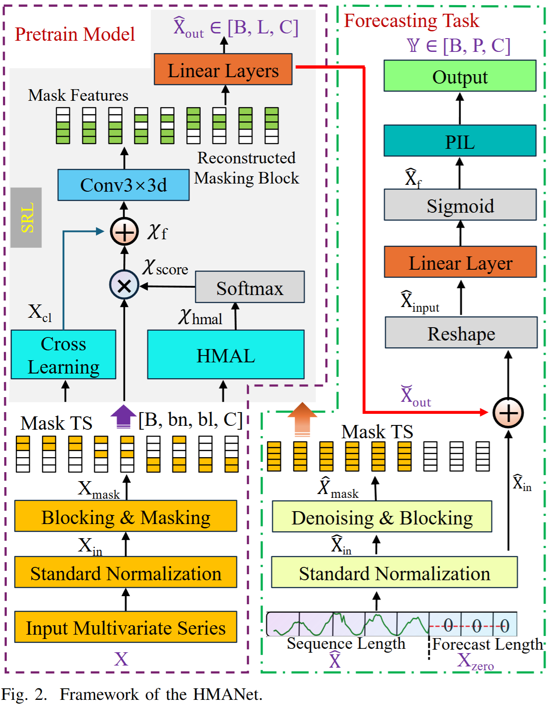
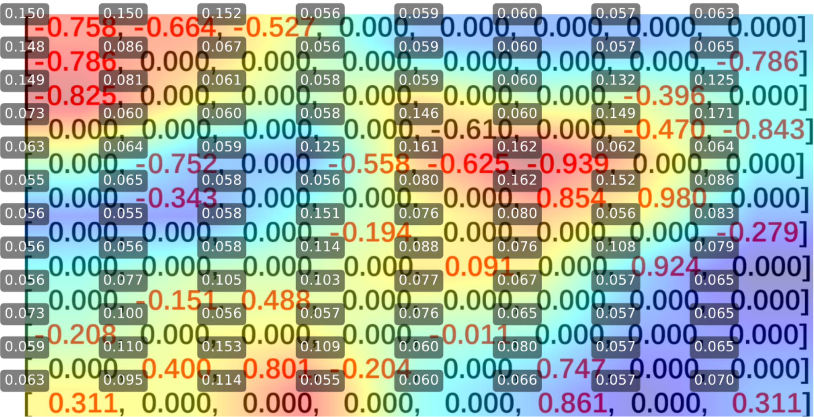
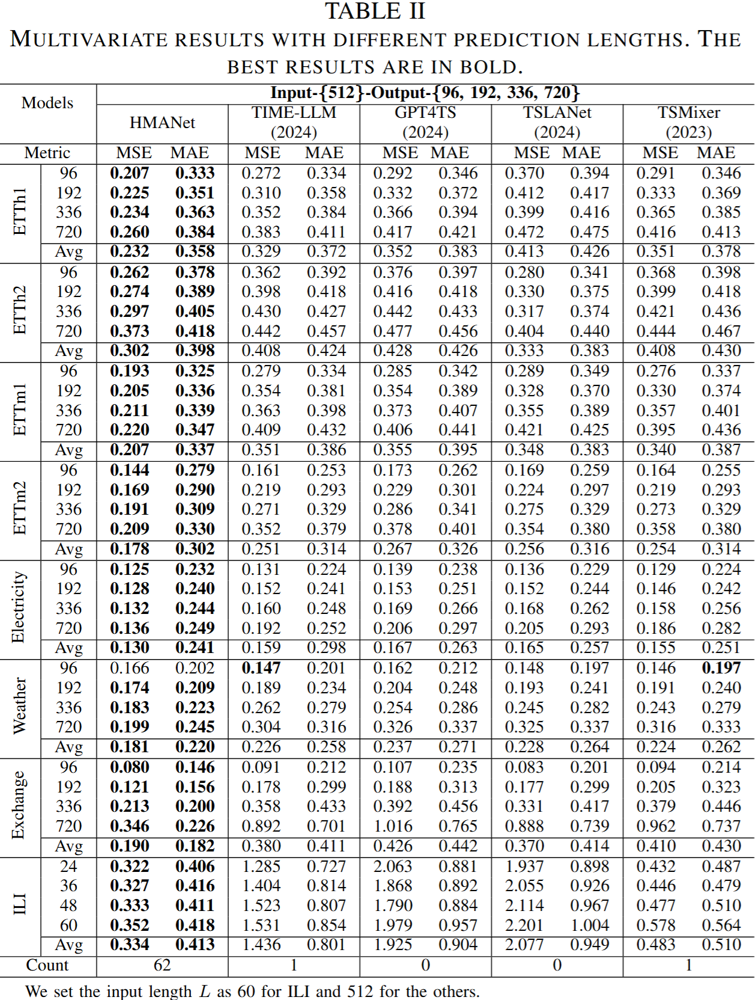
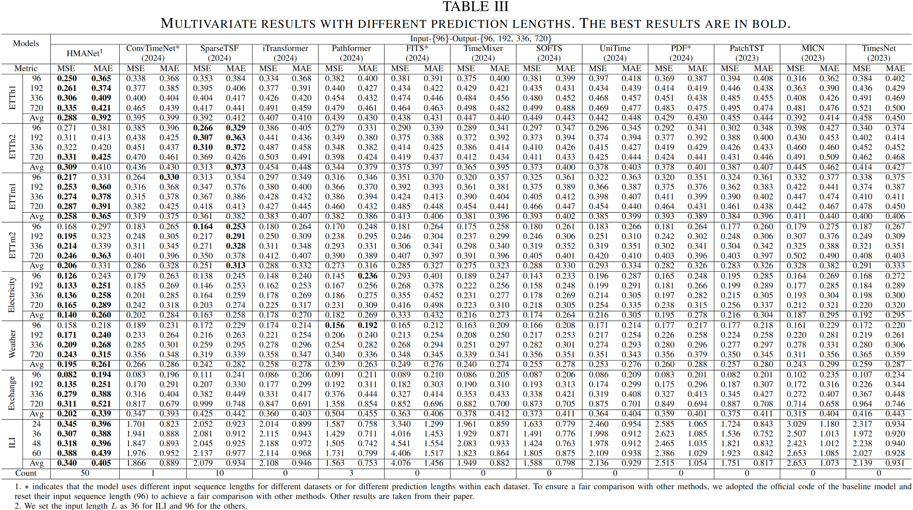
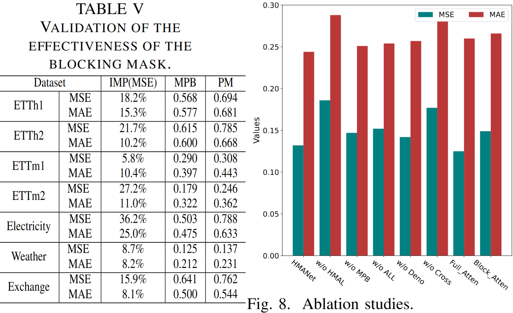
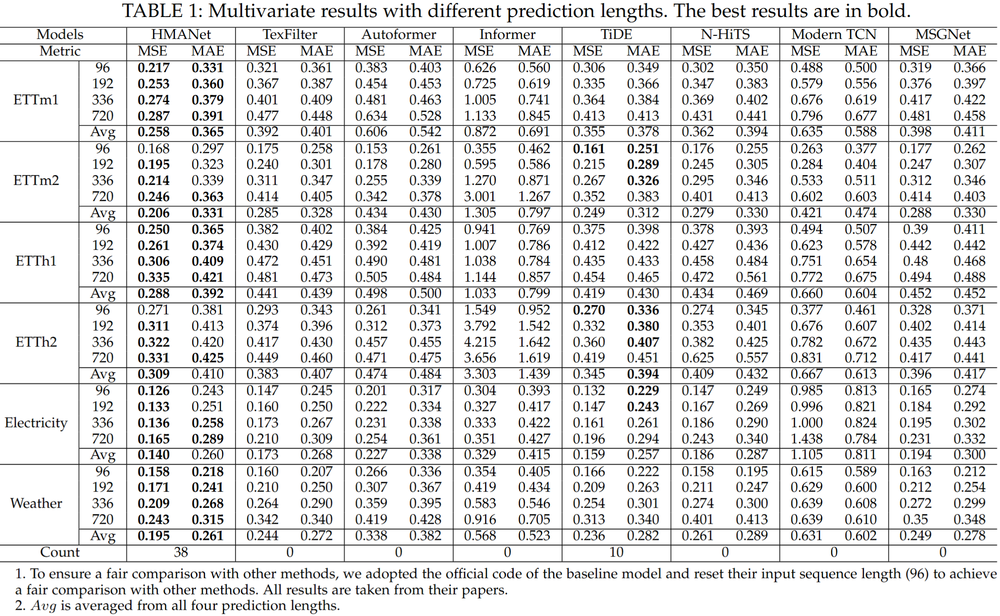
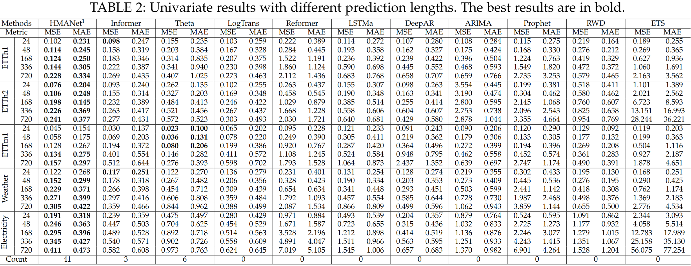
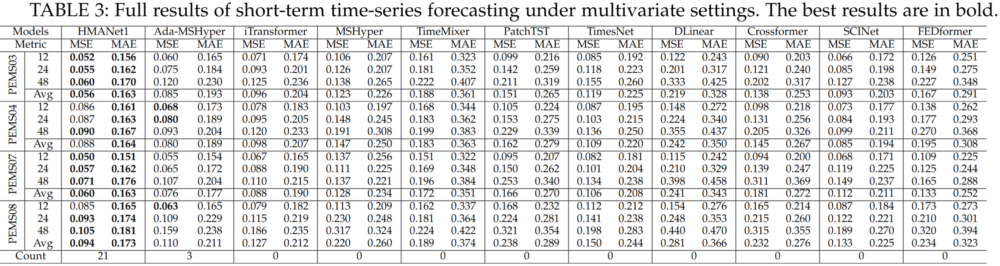

## Get Started


1. Install Python 3.9, PyTorch 1.10.0.
The code is built based on Python 3.9, PyTorch 1.13.0.
You can install PyTorch following the instruction in [PyTorch](https://pytorch.org/get-started/locally/). For example:

```bash
conda install pytorch==1.13.0 torchvision==0.14.0 torchaudio==0.13.0 pytorch-cuda=11.6 -c pytorch -c nvidia
```

After ensuring that PyTorch is installed correctly, you can install other dependencies via:

```bash
pip install -r requirements.txt
```

2. Download data. You can obtain all the eight benchmarks from [baidupan](https://pan.baidu.com/s/19lqv1VLG9VBx7Nh04L1u0A?pwd=mswn 
)password：mswn. **All the datasets are well pre-processed** and can be used easily.

3.Pre-training. The scirpt pretrain_main.py is to train the HMANet. If you want to obtain the pre-trained model for the ETTh1 dataset, simply run the following command, and you will be able to open the Pre_Train/PreTrain_checkpoint folder to view the pre-trained model.
The model will be saved to the "Pre_Train\PreTrain_checkpoint" folder for the downstream tasks. There are several other parameters can be set in the pretrain_main.py script.

```bash
python pretrain_main.py
--pre_train 512
--data custom
--data_path ETTh1.csv
--model_id ETTh1
--enc_in 7
--patch_len 16
--train_percent 0.5
--batch_size 32

```
4.Downstream Forecasting Task. The scripts for downstream forecasting tasks are located in the script directory. 
For example, if you want to get the multivariate forecasting results for ETT dataset, just run the following command, and you can open ./result_LSTF.txt to see the results once the training is done:

```bash
bash ./script/main.sh
```

## 1. HMANet Architecture


## 2. Deformable Attention


## 3. Main Result

HMANet: input-{512}-output-{96, 192, 336, 720}; 

HMANet1: input-{96}-output-{96, 192, 336, 720}


## 4. Ablation Studies


## APPENDIX

## 1. Multivariate Results


## 2. Univariate Results


## 3. Short-term Time Series Forecasting Results


# Acknowledgement

We appreciate the following github repos a lot for their valuable code base or datasets:

https://github.com/zhouhaoyi/Informer2020

https://github.com/zhouhaoyi/ETDataset

https://github.com/laiguokun/multivariate-time-series-data
